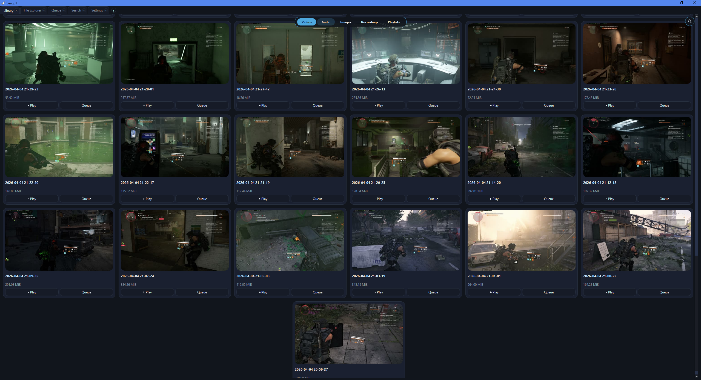
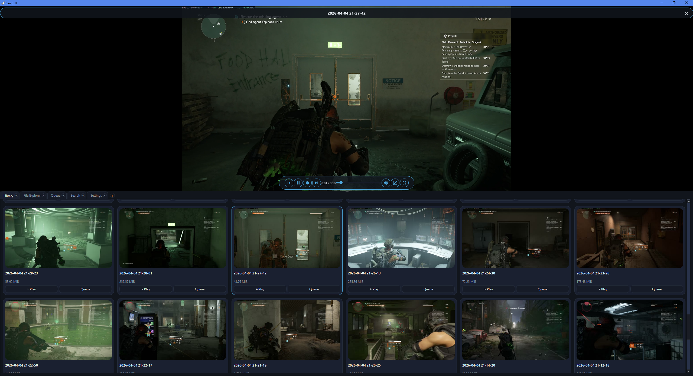
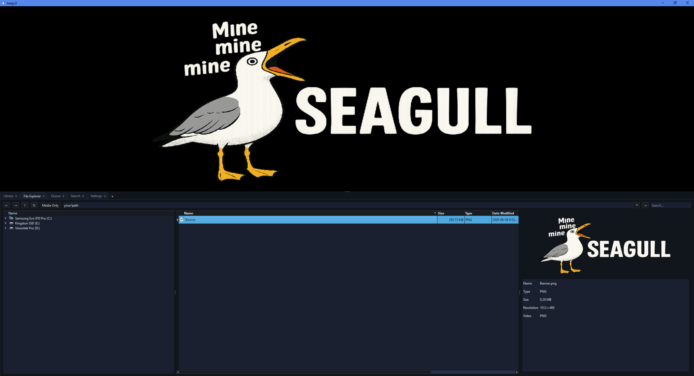
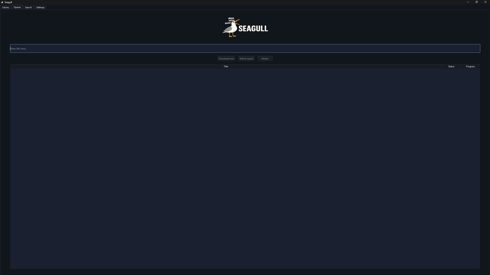
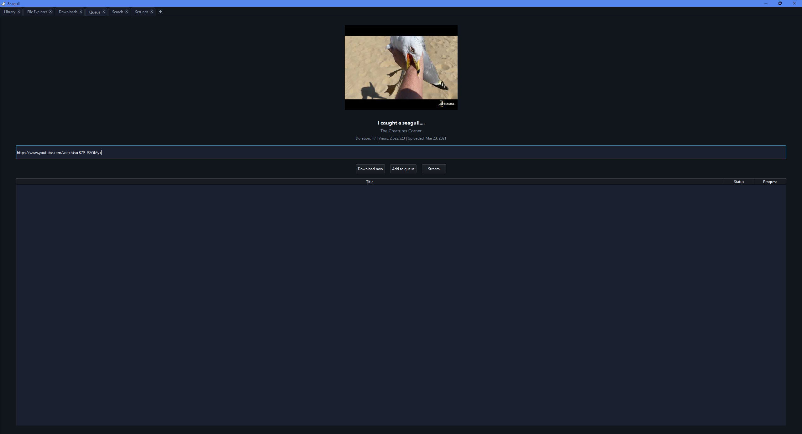
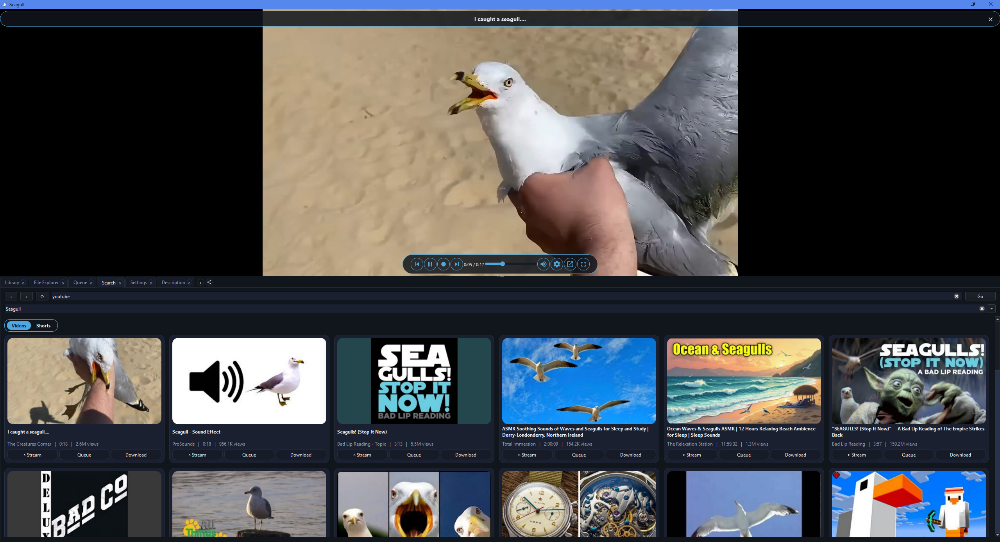
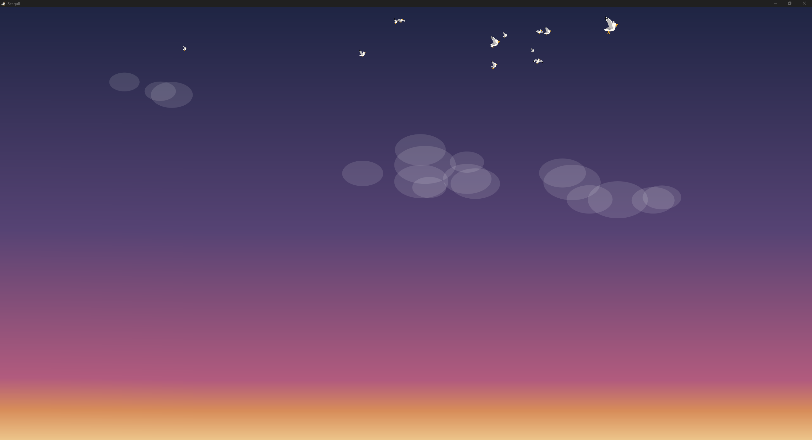

# Seagull

Seagull is a media player and downloader for Windows that folds local playback, online streaming, downloading, search, recording, and a media library into a single app. Local files and online video play through the same player, and anything the resolver can reach can be streamed straight to the screen or saved to disk.

Under the hood it pairs the VLC engine (libVLC) for playback with `yt-dlp` for online resolution and `ffmpeg` for stream processing and recording. Seagull fetches those tools on first run and keeps them current, so you never have to track them down or update them yourself.


## Screenshots

**Library**

<p>
  
  
</p>

**File Explorer**

<p>
  
</p>

**Queue**

<p>
  
  
</p>

**Search**

<p>
  
</p>

**Visualizer**

<p>
  
</p>


## Why Seagull

- **One app instead of three.** Local playback, online streaming, and downloading live in the same place, so there is no juggling a media player, a separate downloader, and a browser tab.
- **The tools manage themselves.** Seagull downloads the resolver, processor, and helper runtime on first run and updates them in place, so you never deal with Python, PATH wrangling, or manual tool updates.
- **A whole workflow, not just a play button.** Search, queue, a media library, recording and clipping, and saved playlists are built in.
- **Private by default.** No accounts and no telemetry; it only touches the network for what you ask it to do.
- **A real desktop app.** Native Qt and VLC rather than a web wrapper, with eight themes, a pop-out player, tear-off tabs, and a layout you can collapse to fit how you watch.


## The player

Everything plays through one libVLC-backed player, whether it came from your disk or the network.

- **Unified playback** for local files and online streams, with adaptive video and audio merged transparently.
- **Overlay controls** that fade in over the video: a seek bar, volume, a quality/format selector, skip, record, share, pop-out, and fullscreen, plus a title banner and an on-screen display.
- **Quality on demand** - pick a different stream quality or format mid-playback from the gear menu; your preferred defaults live in Settings.
- **Pop-out window** - detach the video into its own always-available window and keep watching while you work elsewhere in Seagull or in other apps. Playback never stops moving in or out; closing the pop-out window stops playback.
- **Poster and replay** - a paused or finished video shows a poster frame, and finished media is one click from replaying.
- **Hardware-friendly decoding** - modern codecs are handled sensibly (AV1 decodes in software for stability), with a clean fallback path when a stream URL goes stale.


## Bringing media in

Three ways to get something playing:

- **Paste a link** - drop a URL into the Queue tab to preview it, then stream it to the player or download it to disk. Keep pasting to build a queue.
- **Search** - search from inside the app and browse results as cards (thumbnail, title, channel, length, views), each with one-click Play, Queue, or Download. A Videos / Shorts toggle switches between standard results and a short-form vertical feed that loops at the end and advances as you scroll over the video. The search box remembers your history, with one-tap and on-exit clearing.
- **Browse your disk** - the File Explorer tab is a full local browser (folder tree, sortable file table, a details panel with cover art and metadata, and clipboard operations); double-click anything to play it.


## Live streams and recording

- **Live playback** - live sources play with a seekable window and a `● LIVE` indicator rather than a fixed timeline. Streams that split audio and video, or that interleave ads into the manifest, are reassembled and cleaned up where possible.
- **Recording** - capture a live stream straight to disk while it keeps playing.
- **Clipping** - for a recorded video or a local file, mark a start and an end to save just that range. Finished recordings and clips confirm with a banner and flash in the Library.


## Library, queue, and playlists

- **Library** - a card grid of your saved media with a type switcher for Videos, Audio, Images, Recordings, and Playlists. Cards offer Play and Queue, and thumbnails are generated and cached locally.
- **Queue** - build a play-or-download queue from links or local files. A queue holds one kind at a time (all local or all online) so playback stays predictable.
- **Playlists** - save any queue as a reusable playlist and replay it later from the Library.
- **Folders, your way** - choose where downloads, videos, audio, images, and recordings each land, or unify the media folders into one. Defaults fall back to your standard Windows user folders.


## The workspace

Seagull is built around an adjustable split: the video on top, a row of tabs below.

- **Flexible tabs** - reorder them by dragging, close any tab and reopen it from the floating `+`, or tear a tab off into its own window and drag it back to dock. At least one tab always stays open, and a tab keeps working in the background even while closed. A spinner appears on the Library tab while a download runs.
- **Collapsible layout** - click the divider between the video and the tabs (or the circular chevron at the bottom of the video) to drop the tabs away and let the video fill the window, then bring them back. The split position is remembered between sessions.
- **Themes and sizing** - eight full themes (Seagull, Dark, Light, Coastal Dusk, Foggy Shore, Storm Petrel, Golden Beach, Deep Tide) styled across the entire UI, overlays included, plus an adjustable card size for the search and library grids.


## Tools and upkeep

- **Tools fetched on setup** - the resolver, processor, and helper runtime are not bundled; Seagull downloads them during first-run setup, so the first launch needs an internet connection.
- **First-run setup** - a one-time dialog confirms your folders and fetches any tool that is missing.
- **Self-updating** - on launch Seagull checks for newer versions of its external tools and updates them in place, verified by SHA-256. Auto-update can be turned off, in which case Seagull asks before it touches the network or installs anything.


## Quick start

1. Launch Seagull. On first run, confirm your folders and let it fetch any missing tools.
2. To play something online, open **Queue**, paste a link, and use the preview to **Stream** or **Download**.
3. To find something, open **Search**, type a query, and press Enter; use Play, Queue, or Download on any result.
4. To play local media, use **Library** (your saved files as cards) or **File Explorer** (browse anything on disk).
5. Hover the video for the controls: change quality, record or clip, pop the player out, or go fullscreen.

Preferences live in **Settings**: theme and card size, default download/stream quality and format, your media folders, recording format and location, and search-history behavior. The **Info** page shows this readme, an FAQ, the disclaimer, and the license inside the app.


## Build

**Requirements:** Qt 6.11.1 (MSVC 2022 64-bit), MSVC 2022, CMake 3.20+

```powershell
# From the repo root
cmake -S Seagull -B Seagull/out/build/x64-Debug -G "Visual Studio 17 2022" -A x64
cmake --build Seagull/out/build/x64-Debug --config Debug
```

Or open the repo in Visual Studio and use its built-in CMake integration (`CMakeSettings.json` is preconfigured for `x64-Debug` and `x64-Release`). The Release configuration builds as a GUI app with no console window.

The build copies the Qt runtime (`windeployqt`), the VLC DLLs and plugins, and the `Tools/` folder into the output directory automatically.

**Paths:**
- Qt: `C:/Qt/6.11.1/msvc2022_64`
- VLC SDK: `Seagull/sdk/` (headers, libs, plugins)
- Build output: `Seagull/out/build/x64-Debug/`


## Architecture

Seagull is organized into layers with a clear separation of concerns - the shell holds no playback logic, and all VLC access sits behind one engine:

```
Seagull (orchestrator)
 ├─ MainWindow      window shell: chrome, the video/tabs splitter, fullscreen, player pop-out
 ├─ VideoPlayer     the playback feature widget (overlays, OSD, quality, recording UI)
 │   └─ PlaybackEngine   wraps libVLC (neutral transport API, no VLC types leak out)
 ├─ Tabs            Library · File Explorer · Queue · Search · Settings
 └─ Backend workers SgYtDlp (download/resolve) · SgSearch (discovery) · SgRecorder (capture)
                    · SgThumbnailer (thumbs) · SgUpdater (tool updates) · SgPaths (folders)
```

- `Seagull` builds everything and wires the signals/slots between the UI and the backend workers.
- `MainWindow` is a pure shell with no playback logic; it hosts the `VideoPlayer` and owns window-level concerns (fullscreen, the pop-out, the splitter, overlay repositioning).
- `VideoPlayer` owns the render surface and the top-level overlays; `PlaybackEngine` is the only code that touches VLC.
- Backend classes are `QObject`s. Several resolver instances run in parallel (download, resolve, prefetch, player) so long jobs never block each other, and the tool updater runs on its own thread.


## External tools

Seagull uses three external tools, kept in the app's `Tools/` folder:

- `yt-dlp.exe` - online stream resolution and downloads
- `ffmpeg.exe` / `ffprobe.exe` - stream processing, recording, and media metadata
- `deno.exe` - used by some `yt-dlp` extractors

These are not bundled with Seagull; it downloads any that are missing on first run, so the first launch needs an internet connection. On later launches it checks for newer versions and updates them in place with SHA-256 verification. See `FAQ.md` for how to disable auto-update.


## Documentation

- **`FAQ.md`** - common questions and troubleshooting (also shown on the in-app Info page).
- **`DISCLAIMER.md`** - the Terms of Use shown for acceptance on first run; how you use Seagull is your own responsibility.
- **`THIRD_PARTY_NOTICES.md`** - the components Seagull uses and their licenses.


## License

Licensed under the **GNU GPL v3** - see `LICENSE.txt`.

Seagull is provided as-is; how you use it is your own responsibility. See `DISCLAIMER.md`.

Seagull is built with Qt, libVLC, `yt-dlp`, FFmpeg, and Deno, each under its own license - see `THIRD_PARTY_NOTICES.md`.
