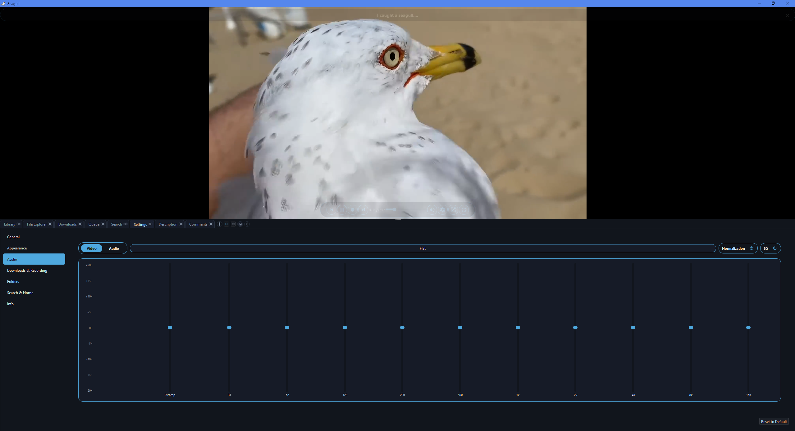

# Seagull

Seagull is a Windows media player and downloader that folds local playback, online streaming, search, downloading, recording, and a media library into one app. Local files and online video play through the same libVLC-backed player, and anything `yt-dlp` can resolve can be streamed or saved to disk. No accounts, no telemetry: it only touches the network for what you ask.

The tools it relies on (`yt-dlp`, `ffmpeg`, `deno`, `AtomicParsley`) aren't bundled. Seagull fetches and updates them itself, so the first launch needs internet but you never wrangle Python, PATH, or manual updates.


## Screenshots

**Library**

<p>
  
  
</p>

**File Explorer**

<p>
  
</p>

**Queue**

<p>
  
  
</p>

**Search**

<p>
  
</p>

**Equalizer**
<p>
  
</p>

**Visualizer**

<p>
  
</p>


## Features

- **One player for everything.** Local files and online streams share the same libVLC engine (adaptive video + audio merged transparently). Fading overlay controls give a seek bar, volume, an on-the-fly quality/format picker, skip, record, share, pop-out, and fullscreen. Paused or finished media shows a poster frame with one-click replay; AV1 decodes in software for stability, and a stale stream URL re-resolves itself once.
- **Pop-out player.** Detach the video into its own window and keep watching while you work elsewhere; playback never drops moving in or out.
- **A 10-band equalizer with real loudness control.** Shape the sound in real time with a graphic EQ that's set independently for audio and video: stock presets per type, save your own, and a power button per type. It runs in Seagull's own audio pipeline, where a look-ahead limiter catches every boost before it can clip, and an optional per-type Normalization evens out quiet and loud material. Lives on the Audio page in Settings, with a floating EQ shortcut while anything plays.
- **Three ways to bring media in.** *Paste a link* in the Queue tab to preview, then stream or download. *Search* across multiple sites as cards with one-click Play/Queue/Download, filter & sort, channel pages, and a Shorts feed that loops, wheel-advances, and preloads the next shorts so scrolling is instant. *Browse your disk* in the File Explorer (folder tree, sortable file table, details panel, clipboard ops).
- **A download manager.** Every card download lands in the Downloads tab: live progress with speed and ETA (plus a slim progress bar on the tab header itself), restart, cancel, and open-folder actions. The list survives restarts, and restarting a download fetches fresh from the source page.
- **Resume where you left off.** Partly watched videos and files pick up from their last position, and each site's home page offers a Continue Watching view of what you haven't finished. Optional, on by default.
- **A home feed built from your favourites.** Star channels and models right on their cards, then let Search open on a personalized feed of their newest videos. In Settings, rank which favourites lead, set how many videos each contributes, and choose whether the feed mixes by recency or keeps your order. Works per supported site, each off its own favourites list.
- **Comments while you watch.** Online videos that have comments get a Comments tab beside the player, with nested, collapsible reply threads. The first batch preloads in the background, so they're ready the moment you open the tab.
- **Audio downloads with artwork.** Saving audio embeds the video thumbnail as album cover art and writes title/artist tags, so files show up properly in any music player.
- **Live and recording.** Live streams play with a seekable window and a `● LIVE` badge (streams that split audio/video or stitch in ads are reassembled where possible). Record a live stream to disk while it plays, or mark a start and end on any video or local file to save just that range.
- **Library, queue, playlists.** A card grid of your saved media (Videos, Audio, Images, Recordings, Playlists) with locally cached thumbnails, sortable by name or date, searchable within a type, and with a multi-select delete mode that sends files to the Recycle Bin. A queue that holds one kind at a time for predictable playback, with optional shuffle; save any queue as a reusable playlist. Choose where each media type lands (downloads can auto-sort by type), or unify them into one folder.
- **A real desktop app.** Native Qt and VLC, not a web wrapper. A collapsible video-over-tabs split, remembered between sessions; tabs reorder, close and reopen, or tear off into their own windows; eight full themes across the whole UI; an audio visualizer that reacts to what's playing. Your keyboard's media keys and the Windows now-playing card control it like any native player.


## Quick start

1. Launch Seagull. On first run, confirm your folders and let it fetch any missing tools.
2. **Online:** open **Queue**, paste a link, and **Stream** or **Download** from the preview.
3. **Discover:** open **Search**, pick a site, type a query, press Enter, then Play/Queue/Download any result. Card downloads land in the **Downloads** tab with live progress.
4. **Local:** use **Library** for your saved files or **File Explorer** to browse the disk.
5. Hover the video for the controls, or use the keyboard while playing: space play/pause, ←/→ seek, ↑/↓ volume, F fullscreen, M mute, `,` / `.` frame-step.

Preferences live in **Settings**; the **Info** page shows this readme, the FAQ, the disclaimer, and the license in-app.


## Build

**Requirements:** Qt 6.11.1 (MSVC 2022 64-bit), MSVC 2022, CMake 3.20+

```powershell
# From the repo root
cmake -S Seagull -B Seagull/out/build/x64-Debug -G "Visual Studio 17 2022" -A x64
cmake --build Seagull/out/build/x64-Debug --config Debug
```

Or open the repo in Visual Studio and use its built-in CMake integration (`CMakeSettings.json` is preconfigured for `x64-Debug` and `x64-Release`). The Release configuration builds as a GUI app with no console window. The build copies the Qt runtime (`windeployqt`), the VLC DLLs and plugins, and the `Tools/` folder into the output automatically.

- Qt: `C:/Qt/6.11.1/msvc2022_64` · VLC SDK: `Seagull/sdk/` · Build output: `Seagull/out/build/x64-Debug/`


## Architecture

Layered, with a clean separation of concerns: the shell holds no playback logic, and all VLC access sits behind one engine.

```
Seagull (orchestrator)
 ├─ MainWindow      window shell: chrome, the video/tabs splitter, fullscreen, player pop-out
 ├─ VideoPlayer     the playback feature widget (overlays, OSD, quality, recording UI)
 │   └─ PlaybackEngine   wraps libVLC (neutral transport API, no VLC types leak out)
 ├─ Tabs            Library · File Explorer · Downloads · Queue · Search · Settings (incl. the Audio/EQ page)
 └─ Backend workers SgYtDlp ×7 (download/resolve/prefetch) · SgSearch (discovery) · SgRecorder (capture)
                    · SgThumbnailer (thumbs) · SgUpdater (tool updates) · SgPaths (folders) · …
```

`Seagull` wires the UI to the backend workers. `MainWindow` is a pure shell; `VideoPlayer` owns the render surface and overlays; `PlaybackEngine` is the only code that touches VLC, and all sound routes through Seagull's own audio stage (EQ, loudness normaliser, brickwall limiter) on a dedicated audio thread. Seven yt-dlp workers run in parallel so long jobs never block each other.

The full engineering reference lives in [`ARCHITECTURE.md`](ARCHITECTURE.md): the startup sequence, threading model, playback pipeline internals, per-module behaviour, and everything the app persists.


## Tools and documentation

Four external tools live in the app's `Tools/` folder, fetched on first run and updated in place (SHA-256 verified) on later launches; auto-update can be turned off (it then asks before checking or installing). `yt-dlp.exe` resolves and downloads online video, `ffmpeg.exe` / `ffprobe.exe` handle stream processing, recording, and metadata, `deno.exe` backs some `yt-dlp` extractors, and `AtomicParsley.exe` lets yt-dlp embed thumbnail cover art into MP3/M4A audio downloads.

Bundled docs: **`FAQ.md`** (troubleshooting, also on the in-app Info page), **`DISCLAIMER.md`** (the Terms of Use accepted on first run), and **`THIRD_PARTY_NOTICES.md`** (component licenses).


## License

GNU GPL v3 - see `LICENSE.txt`. Seagull is provided as-is; how you use it is your own responsibility (see `DISCLAIMER.md`). It is built with Qt, libVLC, `yt-dlp`, FFmpeg, Deno, and AtomicParsley, each under its own license.
